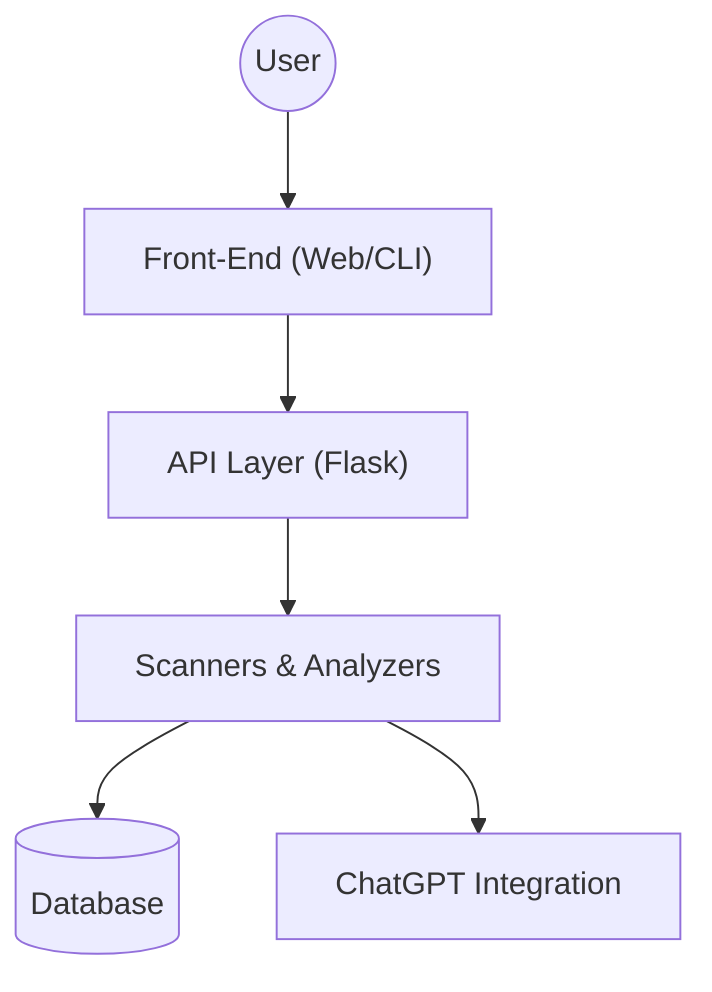

# Architecture Overview

## 1. Introduction

The **Code Analyzer** is built to be modular, scalable, and maintainable. It integrates Python for back-end analysis, optional Node.js for front-end functionality, and Docker for environment isolation. This document provides a high-level overview of its architecture and key components.

---

## 2. High-Level Diagram



- **User**: Interacts via a web-based UI, CLI, or API.
- **API Layer**: Handles requests and orchestrates functionality.
- **Scanners & Analyzers**: Perform checks for file structure, security, and best practices.
- **Database**: (Optional) Stores analysis results or user session data.
- **ChatGPT Integration**: Provides real-time feedback and code suggestions.

---

## 3. Components

### 3.1 Front-End (Web/CLI)
- **Web UI**: Built using Flask templates or optionally Node.js.
- **CLI**: Allows users to trigger scans and view results directly from the terminal.

### 3.2 API Layer
- **Framework**: Flask (Python).
- **Endpoints**: See [API Documentation](api.md) for details.
- **Responsibilities**:
  - Receives user inputs (project path, GitHub URL).
  - Routes requests to the appropriate analyzers.
  - Formats and returns results.

### 3.3 Scanners & Analyzers
- **File Structure Scanner**: Enumerates files and detects redundancies.
- **Security Scanner**: Identifies potential security risks like hardcoded secrets.
- **Docker Scanner**: Validates Dockerfile and docker-compose configurations.
- **ML Workflow Analyzer**: Checks for common ML pipeline issues (e.g., data leakage).
- **Logging Scanner**: Ensures adequate logging and monitoring.
- **Testing Scanner**: Validates testing framework usage and configurations.

### 3.4 Database (Optional)
- **Type**: PostgreSQL or SQLite (depending on deployment).
- **Purpose**:
  - Store analysis results for later retrieval.
  - Maintain user session data or preferences.

### 3.5 ChatGPT Integration
- **API**: Uses OpenAI’s GPT models for interactive suggestions.
- **Examples**:
  - "How do I improve my code’s structure?"
  - "What’s missing in this Dockerfile?"

---

## 4. Data Flow

1. **Input**: User submits a project path or GitHub URL via CLI or Web UI.
2. **Request Handling**: API layer validates input and triggers analysis.
3. **Analysis**:
   - Scanners process the project files.
   - Results are consolidated into a unified report.
4. **Output**:
   - Results are returned via the UI, CLI, or saved to the database.
   - Optionally, ChatGPT provides actionable recommendations.

---

## 5. Deployment Options

### Local
- Run the Python application directly:
  ```bash
  python src/main.py
  ```

### Docker
- Build and run using Docker Compose:
  ```bash
  docker-compose up --build
  ```

### Cloud
- Use container services like AWS ECS, GCP Cloud Run, or Azure Containers for hosting.
- Leverage Kubernetes for scaling and orchestration.

---

## 6. Future Enhancements

- **Real-Time Collaboration**:
  - Allow multiple users to analyze projects simultaneously.
- **Expanded Language Support**:
  - Add analyzers for languages beyond Python and JavaScript.
- **Enhanced Reporting**:
  - Provide richer visualizations (e.g., charts, graphs).
- **Integration with CI/CD Pipelines**:
  - Automate scans during pull requests.
- **Custom Rules**:
  - Allow users to define their own scanning rules.

---

For more technical details, refer to the [Developer Guide](docs/developer_guide.md).

